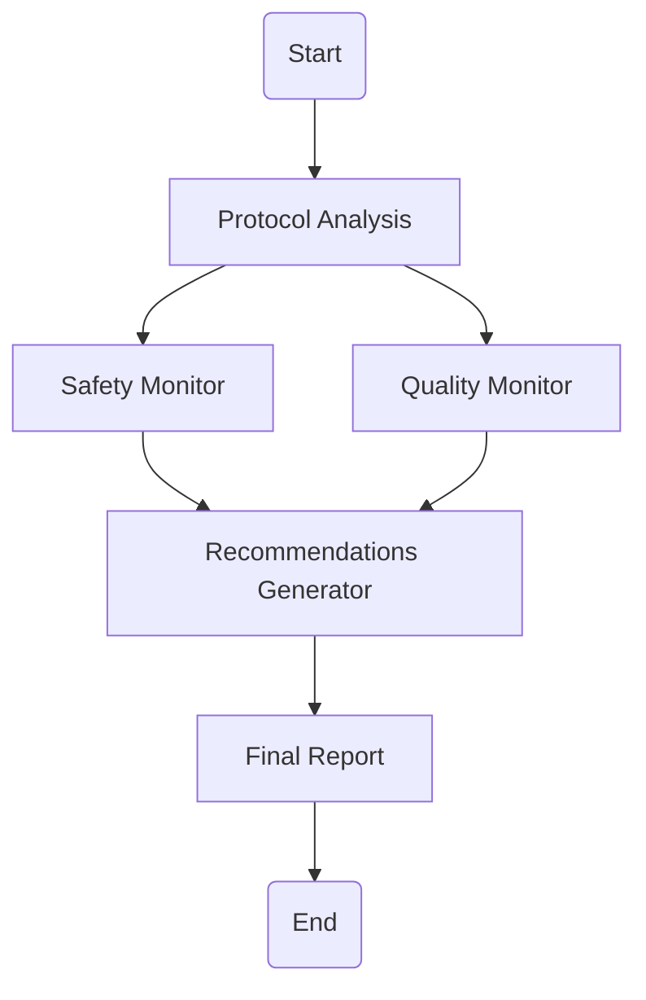

# Clinical Trials Intelligent Assistant

A sophisticated multi-agent AI system designed to analyze clinical trial documents, monitor safety and quality metrics, and generate comprehensive insights.

## 🚀 Features

- **Protocol Analysis**: Extracts key information from clinical trial protocols
- **Safety Monitoring**: Real-time analysis of safety concerns and risks
- **Quality Assessment**: Automated evaluation of data quality and compliance
- **Intelligent Recommendations**: AI-driven insights for trial optimization
- **Comprehensive Reporting**: Detailed analysis reports with actionable insights

## 🛠️ Technology Stack

- **Framework**: Streamlit, LangGraph
- **AI/ML**: LangChain, OpenAI GPT-4
- **Data Processing**: Pandas, Python
- **Visualization**: Streamlit components, Mermaid diagrams

## 📋 Requirements

- Python 3.11+
- OpenAI API key
- Required Python packages (see requirements.txt)

## 🔧 Installation

1. Clone the repository:
```bash
git clone https://github.com/yourusername/clinical-trials-ai.git
cd clinical-trials-ai
```

2. Create and activate a virtual environment:
```bash
python -m venv env
source env/bin/activate  # On Windows use: env\Scripts\activate
```

3. Install dependencies:
```bash
pip install -r requirements.txt
```

4. Set up environment variables:
   - Create a `.env` file in the root directory
   - Add your OpenAI API key:
     ```
     OPENAI_API_KEY=your-api-key-here
     ```

## 🚀 Usage

1. Start the Streamlit app:
```bash
streamlit run app.py
```

2. Upload clinical trial documents through the web interface

3. Select document types and analysis settings

4. View generated insights and recommendations

## 📊 System Architecture



## 🔍 Project Structure

```
clinical-trials-ai/
├── app.py                 # Streamlit web application
├── main.py               # Main graph orchestration
├── agents.py             # AI agent implementations
├── models.py             # Data models and state definitions
├── requirements.txt      # Project dependencies
├── .env                  # Environment variables (local)
├── .streamlit/           # Streamlit configuration
│   └── config.toml       # Streamlit settings
└── README.md            # Project documentation
```

## 💻 Development

### Setting up for Development

1. Fork the repository
2. Create a new branch for your feature
3. Install development dependencies:
```bash
pip install -r requirements-dev.txt
```

### Running Tests

```bash
pytest tests/
```

## 🚀 Deployment

The application can be deployed on Streamlit Cloud:

1. Push your code to GitHub
2. Connect your repository to Streamlit Cloud
3. Set up your environment secrets in the Streamlit Cloud dashboard
4. Deploy!

